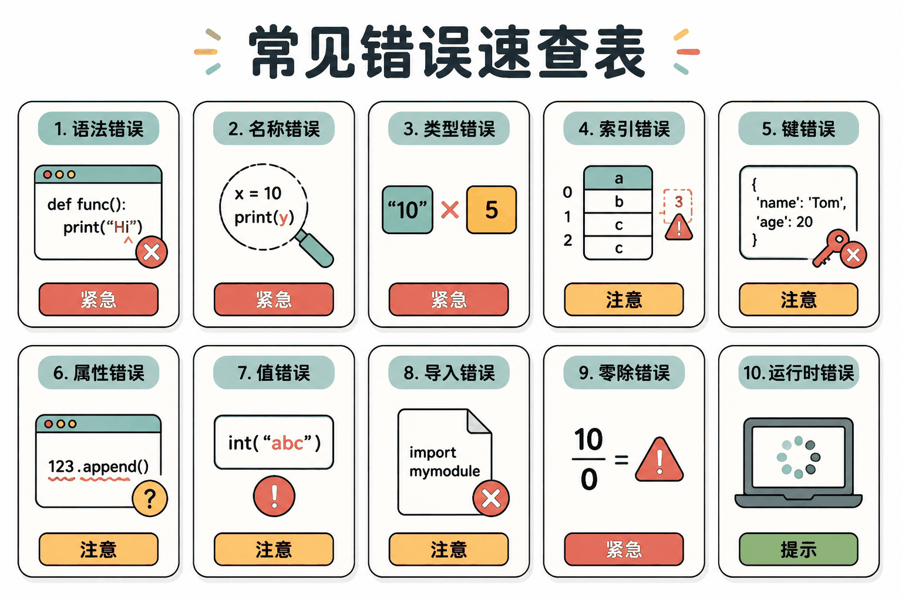

# 附录 B：常见错误与调试

> 本附录收录零基础使用 Python 和 AI 编程工具时最常见的 10 个错误。每个错误按"症状 → 原因 → AI 修复方法 → 验证方式"四段式呈现，可直接复制 prompt 给 AI 求助。

---

## 错误速查表



| 编号 | 错误类型 | 常见于 | 紧急程度 |
|------|----------|--------|----------|
| 1 | IndentationError | 复制代码后、手动缩进时 | 高 |
| 2 | ModuleNotFoundError | 新环境、未装依赖 | 高 |
| 3 | FileNotFoundError | 读写文件、路径写错 | 高 |
| 4 | SyntaxError | 漏写冒号/括号/引号 | 高 |
| 5 | PermissionError | 写入系统目录、C 盘根目录 | 中 |
| 6 | NameError | 变量名拼写错误 | 高 |
| 7 | TypeError | 字符串和数字相加等 | 高 |
| 8 | 环境变量未生效 | AI 工具找不到 API Key | 高 |
| 9 | 端口被占用 | 开发服务器启动失败 | 中 |
| 10 | AI 代码"看起来对但跑不对" | 逻辑错误、边界条件 | 中 |

---

## 错误 1：IndentationError（缩进错误）

### 症状

```
  File "hello.py", line 3
    print("world")
    ^
IndentationError: unexpected indent
```

或

```
IndentationError: expected an indented block
```

### 原因

Python 用缩进（空格或 Tab）表示代码层级，不像其他语言用大括号 `{}`。你从网页复制代码时，可能混用了空格和 Tab；或者 `if`、`for`、`def` 后面忘了缩进下一行。

### AI 修复方法

复制以下 prompt 给 AI：

```text
我运行 [文件名.py] 报 IndentationError，完整错误如下：
[粘贴报错]

请帮我：
1. 检查文件中是否混用了 Tab 和空格
2. 将所有缩进统一为 4 个空格
3. 检查 if/for/def/while 后面的代码块是否正确缩进
4. 修复后告诉我具体改了哪些行
```

### 验证方式

1. 重新运行 `python 文件名.py`，不再报 IndentationError
2. 在 VS Code 底部状态栏确认显示 "Spaces: 4"（点击可切换）
3. 按 `Ctrl+Shift+P` → 搜索 "Convert Indentation to Spaces" 全局转换

---

## 错误 2：ModuleNotFoundError（模块未找到）

### 症状

```
Traceback (most recent call last):
  File "main.py", line 1, in <module>
    import requests
ModuleNotFoundError: No module named 'requests'
```

### 原因

你的 Python 环境里没装这个第三方库。可能的原因：
- 没运行 `pip install requests`
- 装了但装到了全局环境，而你在虚拟环境里运行
- 拼写错误（如 `reqeusts`）

### AI 修复方法

```text
我运行 [python main.py] 报 ModuleNotFoundError: No module named '[模块名]'。

当前环境信息：
- 是否虚拟环境：[是/否，看终端开头有无 (.venv)]
- Python 版本：[python --version 的输出]
- pip 版本：[pip --version 的输出]

请帮我：
1. 确认模块名是否拼写正确
2. 如果是第三方库，给出正确的安装命令
3. 如果是虚拟环境，确认激活命令是否正确
4. 安装后验证是否能正常导入
```

### 验证方式

1. 在终端运行 `python -c "import 模块名"`，没有报错即成功
2. 确认终端提示符前有 `(.venv)` 表示虚拟环境已激活
3. 运行原脚本，不再报 ModuleNotFoundError

---

## 错误 3：FileNotFoundError（文件找不到）

### 症状

```
Traceback (most recent call last):
  File "main.py", line 5, in <module>
    with open("data.txt", "r") as f:
FileNotFoundError: [Errno 2] No such file or directory: 'data.txt'
```

### 原因

程序运行时"站的位置"（当前工作目录）和你想的不一样。`data.txt` 是相对路径，Python 会在当前目录找，但当前目录可能不是文件实际所在的位置。

### AI 修复方法

```text
我运行 [python main.py] 报 FileNotFoundError: [Errno 2] No such file or directory: '[文件名]'。

请帮我：
1. 先让程序执行 `import os; print(os.getcwd())` 打印当前工作目录
2. 用 `os.listdir('.')` 列出当前目录下的文件，确认目标文件是否在这里
3. 如果文件在别处，给出正确的相对路径或改用绝对路径
4. 建议用 pathlib 替代字符串拼接路径，确保跨平台兼容
```

### 验证方式

1. 运行 `python -c "import os; print(os.getcwd())"` 确认当前目录
2. 运行 `ls`（macOS/Linux）或 `dir`（Windows）确认文件存在
3. 重新运行脚本，不再报 FileNotFoundError

---

## 错误 4：SyntaxError（语法错误）

### 症状

```
  File "hello.py", line 2
    if x > 5
            ^
SyntaxError: expected ':'
```

或

```
  File "hello.py", line 3
    print("hello"
                 ^
SyntaxError: unexpected EOF while parsing
```

或

```
  File "hello.py", line 2
    print("hello')
          ^
SyntaxError: unterminated string literal
```

### 原因

Python 语法规则被违反。最常见三种：
- `if`/`for`/`def`/`while` 后面漏了英文冒号 `:`
- 括号（`()`、`[]`、`{}`）没有成对闭合
- 字符串引号不成对（如 `"hello'`）

### AI 修复方法

```text
我运行 [python hello.py] 报 SyntaxError，完整错误如下：
[粘贴完整报错，包含 ^ 指向的那一行]

请帮我：
1. 指出具体是哪一行、哪个符号导致的语法错误
2. 说明正确的写法应该是什么
3. 检查文件中是否还有其他类似的语法问题
4. 修复后告诉我修改了哪些地方
```

### 验证方式

1. 重新运行 `python 文件名.py`，不再报 SyntaxError
2. 用 VS Code 的 Python 扩展，看代码是否有红色波浪线
3. 运行 `python -m py_compile 文件名.py` 做纯语法检查（不执行代码）

---

## 错误 5：PermissionError（权限不足）

### 症状

```
Traceback (most recent call last):
  File "main.py", line 4, in <module>
    with open("C:\\output.txt", "w") as f:
PermissionError: [Errno 13] Permission denied: 'C:\\output.txt'
```

### 原因

你试图往系统保护的目录（如 Windows C 盘根目录、macOS 系统目录）写入文件，但当前用户没有权限。或者文件被其他程序占用（如用 Excel 打开着）。

### AI 修复方法

```text
我运行 [python main.py] 报 PermissionError: [Errno 13] Permission denied: '[路径]'。

我的操作系统是 [Windows/macOS/Linux]。

请帮我：
1. 分析这个路径为什么需要特殊权限
2. 建议一个当前用户有权限的替代路径（如用户桌面、文档文件夹、项目目录）
3. 如果确实需要写入系统目录，给出以管理员身份运行的正确方式（并提醒风险）
4. 检查文件是否被其他程序占用
```

### 验证方式

1. 将输出路径改为项目目录下的子目录（如 `./output/output.txt`）
2. 重新运行脚本，不再报 PermissionError
3. 确认文件确实被创建在预期位置

---

## 错误 6：NameError（变量名拼写错误）

### 症状

```
Traceback (most recent call last):
  File "main.py", line 3, in <module>
    print(mesage)
NameError: name 'mesage' is not defined
```

### 原因

使用了未定义的变量名。通常是拼写错误（如 `mesage` 应为 `message`），或者变量定义在使用之后，或者变量定义在函数内部但试图在函数外部使用。

### AI 修复方法

```text
我运行 [python main.py] 报 NameError: name '[变量名]' is not defined。

相关代码片段：
[粘贴报错行附近的代码，约 5-10 行]

请帮我：
1. 检查是否有拼写错误（如 mesage vs message）
2. 检查变量是否在使用之后才定义
3. 检查变量是否定义在函数内部但在外部使用
4. 给出修复后的代码
```

### 验证方式

1. 重新运行脚本，不再报 NameError
2. 在 VS Code 中，未定义变量通常会有黄色/红色下划线提示
3. 确认程序输出符合预期

---

## 错误 7：TypeError（类型错误）

### 症状

```
Traceback (most recent call last):
  File "main.py", line 2, in <module>
    result = "年龄：" + 25
TypeError: can only concatenate str (not "int") to str
```

或

```
TypeError: 'int' object is not callable
```

### 原因

对错误类型的数据执行了不支持的操作。常见场景：
- 字符串 + 数字（Python 不会自动转换）
- 把整数当函数调用（如 `x = 5; x()`）
- 给函数传了错误类型的参数

### AI 修复方法

```text
我运行 [python main.py] 报 TypeError，完整错误如下：
[粘贴报错]

相关代码：
[粘贴报错行及前后 3 行]

请帮我：
1. 指出涉及的两个数据分别是什么类型
2. 说明正确的类型转换方式（如 str()、int()、float()）
3. 给出修复后的代码
4. 解释为什么 Python 不允许这种操作
```

### 验证方式

1. 重新运行脚本，不再报 TypeError
2. 用 `type(变量名)` 打印变量类型，确认符合预期
3. 确认程序输出结果正确

---

## 错误 8：环境变量未生效（AI 工具找不到 API Key）

### 症状

```
Error: ANTHROPIC_API_KEY is not set. Please set it as an environment variable.
```

或

```
401 Unauthorized: Invalid API key
```

或 AI 工具启动后反复要求输入 API Key。

### 原因

环境变量设置了但没有生效，常见原因：
- Windows 用 `set` 设置后没有重启终端
- 写入了配置文件但没有 `source`（macOS/Linux）
- 配置文件路径写错（如 `.bashrc` vs `.zshrc`）
- API Key 本身过期或余额不足

### AI 修复方法

```text
我配置 [Claude Code / Kimi Code / 其他工具] 时，环境变量似乎没生效。

我的操作系统是 [Windows/macOS/Linux]。
我已做的操作：[如：在 .zshrc 里加了 export / 在系统设置里加了环境变量]

请帮我：
1. 确认我编辑的配置文件是否正确（不同 Shell 用不同文件）
2. 给出使配置生效的正确命令
3. 给出验证环境变量是否生效的方法
4. 如果已生效但仍报错，检查 API Key 是否有效（如余额、格式）
```

### 验证方式

1. **Windows PowerShell**：运行 `$env:ANTHROPIC_API_KEY`，看是否有值输出
2. **macOS/Linux**：运行 `echo $ANTHROPIC_API_KEY`，看是否有值输出
3. 重新打开一个全新的终端窗口，再次验证
4. 运行 AI 工具，不再提示缺少 API Key

---

## 错误 9：端口被占用（开发服务器启动失败）

### 症状

```
Error: listen EADDRINUSE: address already in use :::3000
```

或

```
OSError: [Errno 98] Address already in use: ('0.0.0.0', 8000)
```

### 原因

上一次运行的开发服务器没有正确关闭，还在后台占用着端口。或者另一个程序（如另一个项目）正在使用这个端口。

### AI 修复方法

```text
我启动开发服务器时报 "address already in use"，端口是 [3000/8000/其他]。

我的操作系统是 [Windows/macOS/Linux]。

请帮我：
1. 找出占用这个端口的进程
2. 给出终止该进程的安全命令
3. 或者给出让服务器使用另一个端口的命令
4. 告诉我如何避免这个问题（如正确关闭服务器的方式）
```

### 验证方式

1. **Windows**：运行 `netstat -ano | findstr :3000`，然后 `taskkill /PID <进程号> /F`
2. **macOS/Linux**：运行 `lsof -i :3000`，然后 `kill -9 <进程号>`
3. 重新启动开发服务器，成功监听端口
4. 浏览器访问 `http://localhost:3000`（或对应端口），页面正常加载

---

## 错误 10：AI 生成的代码"看起来对但跑不对"（逻辑错误）

### 症状

- 程序没有报错，但输出结果不对
- 计算结果和预期相差很大
- 某些边界情况（如空列表、负数）处理错误
- 测试通过了大部分，但有几个失败

### 原因

这是最难发现的错误类型——语法正确，但逻辑有缺陷。常见原因：
- AI 误解了你的需求
- 边界条件没处理（如空输入、最大值）
- 算法逻辑有漏洞（如循环少迭代一次）
- 变量在不该变的时候被修改了

### AI 修复方法

```text
AI 帮我生成的代码能运行，但结果不对。

预期行为：[描述你期望程序做什么]
实际行为：[描述程序实际做了什么，包括具体输出]

相关代码：
[粘贴代码]

测试用例：
- 输入：[具体输入] → 期望输出：[具体输出] → 实际输出：[具体输出]
- 输入：[边界情况] → 期望输出：[具体输出] → 实际输出：[具体输出]

请帮我：
1. 分析代码逻辑为什么会产生错误结果
2. 指出具体哪一行有问题
3. 给出修复后的代码
4. 用我提供的测试用例验证修复是否正确
```

### 验证方式

1. 准备至少 3 个测试用例：正常情况、边界情况、异常情况
2. 运行修复后的代码，所有测试用例输出符合预期
3. 让 AI 为这段代码编写单元测试，确保后续修改不会破坏功能
4. 人工阅读修复后的代码，确认逻辑合理

---

## 通用调试流程图

```
程序出错了？
    │
    ├── 有报错信息？ ──→ 找到最后一行错误类型和行号 ──→ 翻到本附录对应错误
    │
    └── 没报错但结果不对？ ──→ 用 print() 或调试器逐行检查变量值
                              │
                              ├── 找到变量值异常的位置
                              │
                              └── 检查 AI 生成的逻辑是否符合你的真实需求
```

---

## 给 AI 的高效提问模板

遇到任何错误时，复制以下模板填空，能大幅提升 AI 的修复效率：

```text
【错误报告模板】

错误类型：[如 IndentationError / ModuleNotFoundError / 逻辑错误]
完整报错：
```
[粘贴完整报错信息，不要省略]
```

操作系统：[Windows / macOS / Linux]
Python 版本：[python --version 的输出]
相关代码：
```python
[粘贴出错的代码片段，约 10-20 行]
```

已尝试的修复：[如已重装依赖、已检查路径]

请帮我：
1. 分析根本原因
2. 给出具体修复步骤
3. 告诉我如何验证已修复
```

---

> 记住：报错信息不是敌人，是程序在告诉你它哪里不舒服。学会阅读报错，你就已经超过 80% 的初学者了。
