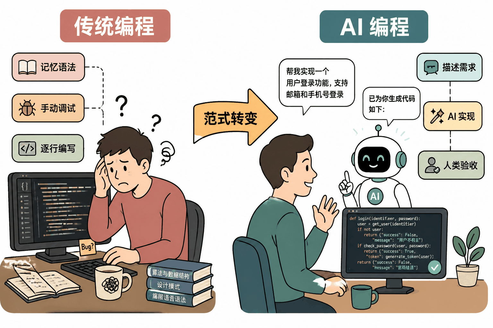
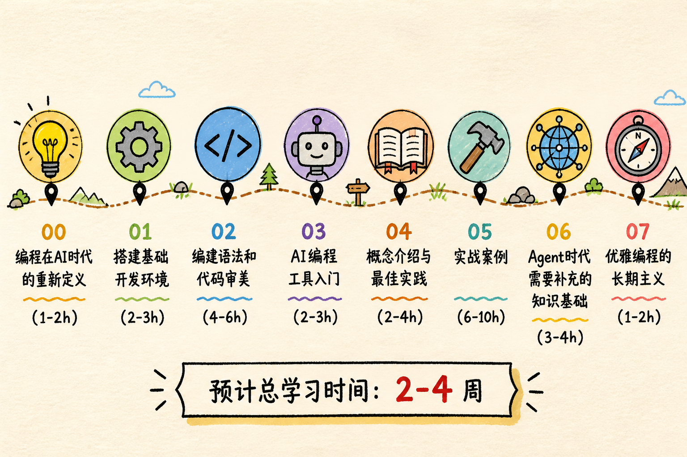

# 00 编程在AI时代的重新定义

## 为什么零基础的你，现在学编程刚刚好

如果你曾经觉得"编程"是程序员的专属技能，是写在黑底白字屏幕上的天书，那么这一章会彻底改变你的看法。

AI的出现，让编程这件事发生了本质性的变化。过去，学编程意味着你要记住成百上千个函数名、语法规则和库接口，像背字典一样枯燥。而现在，AI可以替你记住这一切。你只需要用大白话告诉AI你想做什么，它就能帮你写出代码。这就像你不需要懂发动机原理，也能开车到达目的地——但如果你想开得更好、走得更远，了解基本的驾驶知识仍然必不可少。

更重要的是，"会用AI"和"不会用AI"正在成为两种截然不同的状态。会用AI的人，可以自动化处理重复工作、快速验证想法、把创意变成现实；不会用AI的人，仍然被困在手动复制粘贴和重复劳动里。编程思维——把大问题拆成小问题、用逻辑步骤解决它们的能力——恰恰是让你从"AI的普通用户"变成"AI的高效驾驭者"的关键。

所以，零基础不是劣势，恰恰相反，**你现在开始学，反而占了天时**。

---

## 零基础的后发优势

你可能不知道，很多"老程序员"其实正面临着和你类似的困扰。他们花了十年时间记住的语法细节、积累的特定框架经验，在AI时代正在快速贬值。他们习惯了手写每一行代码，反而很难适应"让AI来写"的新工作方式。改变旧习惯，比从零建立新习惯要困难得多。

而你不一样。你没有"必须手写代码"的心理包袱，没有"不用某个框架就不专业"的执念。你可以直接学习AI时代最高效的编程方式：

- **用自然语言描述需求**，让AI生成第一版代码
- **像审阅文档一样审阅代码**，理解逻辑而不是死记语法
- **小步快跑，快速迭代**，而不是一次性写几百行再调试
- **遇到问题先问AI**，把搜索引擎的"关键词猜测游戏"变成"直接对话"

这就像学开车。如果你之前只会骑马，你可能总想把缰绳的逻辑套到方向盘上；但如果你什么交通工具都没学过，你可以直接上手最现代的智能驾驶。

---

## 你需要什么数学/英语基础

先说结论：**几乎为零。**

这不是安慰话，而是事实。AI时代的编程，核心能力不再是"记住语法"，而是**清晰表达你的需求**和**理解代码的逻辑**。这两件事和数学、英语的关系，远比你想象的要小。

**关于数学**：你不需要会微积分、线性代数或者概率论。这本书里的所有案例，用到的数学知识不超过小学水平——加减乘除、比较大小、判断条件。AI处理的是代码生成，复杂的算法它自己就能搞定。你需要的是逻辑思维：如果A发生，就做B；如果C不成立，就做D。这种"如果……那么……"的思考方式，每个人每天都在用。

**关于英语**：你不需要背几千个单词，也不需要看懂长篇技术文档。AI可以帮你把中文需求翻译成代码，也可以把英文报错翻译成中文解释。当然，认识一些基础词汇会有帮助——比如"file"是文件、"name"是名字——但这些词你在使用电脑的过程中早就见过了。如果你会用"Ctrl+C"和"Ctrl+V"，你的英语基础已经够用了。

真正重要的只有两件事：

1. **逻辑思维**——能把"我想整理下载文件夹"拆解成"第一步做什么、第二步做什么"
2. **清晰表达**——能用准确的句子描述你想要的结果，而不是模糊的"帮我弄一下"

这两件事，不需要天赋，只需要练习。而这本书的每一个案例，都是练习的机会。

> [配图占位：此处应有 AI 时代编程者能力模型示意图，详见附录D]

---

## 30天后的你

让我们做一个具体的想象。

30天后，你坐在电脑前，桌面上堆满了从各处下载的文件——照片、PDF文档、压缩包、安装程序，混在一起，找什么都得翻半天。你打开一个对话框，用大白话描述了你的困扰，然后复制粘贴了一段AI生成的代码。你运行它，不到3秒钟，所有文件自动归类到了"图片""文档""压缩包""其他"四个文件夹里。你的桌面瞬间变得整洁有序。

你有点不敢相信，又试了一次。这次是一堆从相机导出的照片，文件名都是乱码一样的"IMG_20240115_143022.jpg"。你再次描述需求，AI帮你写了一个脚本，把所有照片按拍摄日期重命名为"2024-01-15-001.jpg""2024-01-15-002.jpg"……整整齐齐。你甚至把这个脚本发给了朋友，朋友惊呼"你怎么突然会编程了"。

你会心一笑。你知道自己并没有变成传统意义上的"程序员"，但你掌握了一种新的超能力：**用AI把想法变成现实**。这30天里，你没有死记硬背任何语法，而是通过一个个实际的小项目，学会了如何与AI协作、如何描述问题、如何验证结果。

这就是30天后的你。不是代码大师，而是一个能高效解决问题的人。

---

## 本章学习路线图预览

这本书不会教你成为专业程序员，而是教你成为**AI时代的高效问题解决者**。接下来的章节安排如下：

- **第01章：搭建基础开发环境**——安装VS Code、Git、Python和AI编程工具，配置好你的开发"工作台"
- **第02章：编程语法和代码审美**——用最少的时间了解Python的基本规则，重点是"看懂代码"而不是"背下语法"
- **第03章：AI编程工具入门**——掌握"描述需求→生成代码→运行验证→迭代优化"的完整循环
- **第04章：AI编程核心概念与最佳实践**——理解Agent循环、上下文管理、权限安全，学会和AI高效协作
- **第05章：实战案例**——两个完整项目：自动整理下载文件夹、批量重命名照片，全程只用Python标准库，零外部依赖
- **第06章：AI编程时代需要补充的知识基础**——HTTP、JSON、文件路径、环境变量等你需要知道的技术常识
- **第07章：优雅编程的长期主义**——产品思维、安全意识、持续学习，学完之后往哪里走？

每一章都遵循一个原则：**先动手，再理解**。你不需要在第一章就搞懂所有概念，而是先做出一个能跑的东西，获得成就感，然后再慢慢理解背后的原理。

准备好了吗？让我们开始吧。
