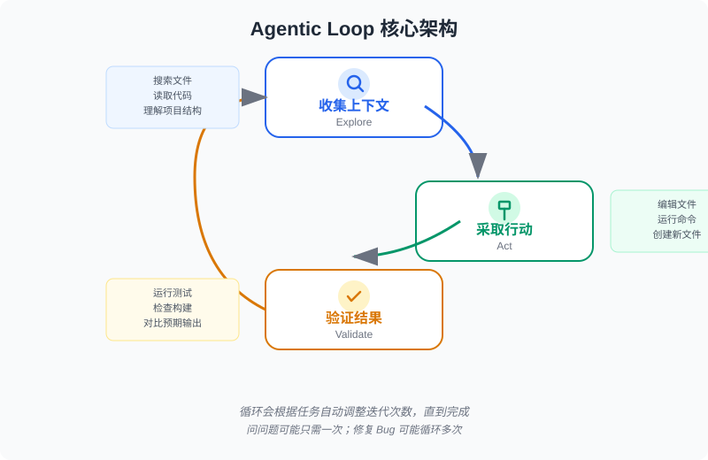

根据 Claude Code 官方中文文档的全部内容，我为你整理了一份 **AI 编程（Agentic Coding）概念介绍与最佳实践** 的完整指南。

---

# AI 编程（Agentic Coding）概念介绍与最佳实践

> 基于 [Claude Code 官方文档](https://code.claude.com/docs/zh-CN/) 整理

---

## 一、什么是 AI 编程（Agentic Coding）

### 1.1 核心定义

**Agentic Coding（代理式编程）** 是一种全新的编程工作流：AI 不再只是回答问题的聊天机器人，而是能够**自主读取文件、运行命令、编辑代码、验证结果**的编码代理。你可以描述想要什么，让 AI 自己探索、规划和实现。

> 与传统聊天助手的区别：传统助手只能用文本回应，你需要手动复制粘贴代码；而 Agentic 工具拥有**工具（Tools）**，可以直接在你的代码库中采取行动。

### 1.2 Claude Code 的定位

Claude Code 是一个**代理框架（Agentic Harness）**，它将语言模型转变为能够编码的代理：
- **模型（Claude）** 负责推理和理解代码
- **Harness** 提供文件访问、Shell 执行、权限控制、内存管理和操作循环
- 支持终端、VS Code、JetBrains、桌面应用、浏览器等多种界面

---

## 二、核心架构：代理循环（Agentic Loop）

### 2.1 三步循环

当你给 Claude 一个任务时，它会经历三个融合的阶段：



```
┌─────────────┐    ┌─────────────┐    ┌─────────────┐
│  收集上下文  │ → │   采取行动   │ → │   验证结果   │
│  (Explore)  │    │  (Act)      │    │ (Validate)  │
└─────────────┘    └─────────────┘    └─────────────┘
         ↑_________________________________↓
```

- **收集上下文**：搜索文件、读取代码、理解项目结构
- **采取行动**：编辑文件、运行命令、创建新文件
- **验证结果**：运行测试、检查构建、对比预期输出

循环会根据任务自动调整：问问题可能只需要收集上下文；修复 Bug 会循环多次；重构需要广泛验证。

### 2.2 五大内置工具类别

> [配图占位：此处应有扩展功能体系层次图，详见附录D]

| 类别 | 能力 | 示例 |
|------|------|------|
| **文件操作** | 读取、编辑、创建、重命名文件 | 修改 `src/auth.js`（文件路径详见第06章2.1节） |
| **搜索** | 按模式查找文件、正则搜索 | `grep` 查找所有 `TODO` |
| **执行** | 运行 Shell 命令、Git、测试 | `npm test`（包管理器详见第06章3.1节）、`git commit` |
| **网络** | 搜索网页、获取文档 | 查找错误消息的官方文档 |
| **代码智能** | 类型检查、跳转到定义 | 查看类型错误和警告 |

### 2.3 扩展层（插入代理循环）

```
┌─────────────────────────────────────────┐
│           扩展功能体系                    │
├─────────┬─────────┬─────────┬───────────┤
│ CLAUDE.md│ Skills  │  MCP    │ Subagents │
│ (持久记忆)│ (知识库) │ (外部工具)│ (隔离执行) │
├─────────┴─────────┴─────────┴───────────┤
│              Hooks (确定性自动化)          │
└─────────────────────────────────────────┘
```

---

## 三、关键概念术语表

| 术语 | 定义 |
|------|------|
| **Agentic Loop** | Claude 为每个任务经历的循环：收集上下文 → 采取行动 → 验证结果 → 重复直到完成 |
| **Context Window** | 会话的工作内存，保存对话历史、文件内容、命令输出、CLAUDE.md、skills 等 |
| **Compaction** | 上下文窗口接近限制时的自动总结机制，清除旧工具输出并总结对话 |
| **CLAUDE.md** | 包含持久指令的 Markdown 文件，每个会话开始时加载，用于存储项目约定 |
| **Auto Memory** | Claude 自动保存的学习笔记（构建命令、调试见解、偏好），存储在 `~/.claude/projects/` |
| **Skill** | 包含指令、知识或工作流的 `SKILL.md` 文件，可自动加载或手动调用（如 `/deploy`） |
| **Subagent** | 在独立上下文窗口中运行的专门 AI 助手，返回摘要结果，用于隔离任务 |
| **MCP** | Model Context Protocol，连接 AI 与外部服务（数据库、Slack、浏览器等）的开放标准 |
| **Hook** | 在 Claude 生命周期特定点自动执行的确定性脚本（如文件编辑后运行 ESLint） |
| **Plugin** | 将 skills、hooks、subagents 和 MCP 服务器打包为单个可安装单元 |
| **Checkpoint** | 每次文件编辑前的自动快照，可按 `Esc` 两次或 `/rewind` 回退 |
| **Permission Mode** | 控制 Claude 是否需要批准：default / acceptEdits / plan / auto / dontAsk |
| **Plan Mode** | 只读分析模式，Claude 研究并提议更改但不编辑文件，适合复杂变更前的规划 |
| **Auto Mode** | 分类器模型后台审查操作，自动批准安全操作，阻止风险操作 |
| **Sandboxing** | Bash 命令的操作系统级文件系统和网络隔离 |

---

## 四、最佳实践

### 4.1 核心约束：上下文窗口管理

> [配图占位：此处应有上下文窗口管理示意图，详见附录D]

> **最重要的约束**：Claude 的上下文窗口填充很快，随着填充，性能会下降。当窗口快满时，Claude 可能"遗忘"早期指令或犯更多错误。

**管理策略：**
- 在不相关任务之间频繁使用 `/clear` 重置上下文
- 使用 `/compact focus on ...` 手动压缩并保留关键内容
- 使用 `/btw` 进行快速旁白提问（不进入对话历史）
- 使用 **Subagents** 委托研究任务，保持主对话干净

### 4.2 给 Claude 验证方式（最高杠杆操作）

| ❌ 之前 | ✅ 之后 |
|--------|--------|
| "实现一个验证邮箱的函数" | "编写 `validateEmail` 函数。测试用例：`user@example.com` → true，`invalid` → false。实现后运行测试" |
| "让仪表盘更好看" | "[粘贴截图] 实现此设计。对结果截图并与原设计对比，列出差异并修复" |
| "构建失败了" | "构建失败，错误：[粘贴错误]。修复它并验证构建成功，解决根本原因" |

### 4.3 先探索，再规划，最后编码

**推荐四阶段工作流：**

1. **探索**（Plan Mode）：`read /src/auth and understand how we handle sessions`
2. **规划**：`I want to add Google OAuth. What files need to change? Create a plan.`
3. **实现**（Normal Mode）：`implement the OAuth flow from your plan. write tests and fix failures.`
4. **提交**：`commit with a descriptive message and open a PR`

> **何时跳过规划**：范围明确的小任务（修复拼写错误、添加日志、重命名变量）——如果能用一句话描述 diff，直接执行。

### 4.4 编写有效的 CLAUDE.md

**原则：保持简洁（200行以下），只放 Claude 猜不到的东西**

| ✅ 包含 | ❌ 排除 |
|--------|--------|
| Claude 无法猜测的 Bash 命令 | Claude 能通过读代码弄清楚的 |
| 与默认值不同的代码风格 | 标准语言约定 |
| 测试指令和首选测试运行器 | 详细 API 文档（改为链接） |
| 仓库礼仪（分支命名、PR 约定） | 经常变化的信息 |
| 特定项目的架构决策 | 长解释或教程 |
| 常见陷阱或非显而易见的行为 | "编写干净代码"这类自明建议 |

**CLAUDE.md 文件位置层级：**
```
托管策略（组织级）→ 用户级 (~/.claude/CLAUDE.md) → 项目级 (./CLAUDE.md) → 本地 (./CLAUDE.local.md)
```

**进阶组织：使用 `.claude/rules/`**
```markdown
---
paths:
  - "src/api/**/*.ts"
---
# API 开发规则
- 所有端点必须包含输入验证
- 使用标准错误响应格式
```

### 4.5 配置环境提升效率

| 配置项 | 作用 |
|--------|------|
| **权限模式** | Auto mode 减少中断；`/permissions` 白名单信任命令 |
| **CLI 工具** | 安装 `gh`、`aws`、`gcloud` 等 CLI，Claude 会高效使用 |
| **MCP 服务器** | `claude mcp add` 连接外部工具（Notion、Figma、数据库） |
| **Hooks** | 自动化必须每次发生的操作（如编辑后运行 ESLint） |
| **Skills** | `.claude/skills/` 中创建可重用工作流（如 `/fix-issue`） |
| **Subagents** | `.claude/agents/` 中定义专门助手（如安全审查员） |

### 4.6 有效沟通技巧

**像委派给有能力的同事一样对话：**
```
❌ "打开 src/auth/login.ts，在第 45 行添加 null 检查，然后运行 npm test"
✅ "登录流程对持有过期卡的用户已损坏。相关代码在 src/payments/ 中。调查并修复它。"
```

**让 Claude 采访你（大功能）：**
```
I want to build [简述]. Interview me in detail using the AskUserQuestion tool.
Ask about technical implementation, UI/UX, edge cases, concerns, and tradeoffs.
Keep interviewing until we've covered everything, then write a complete spec to SPEC.md.
```

**使用 `@` 引用文件：**
```
Explain the logic in @src/utils/auth.js
What's the structure of @src/components?
```

### 4.7 会话管理

| 操作 | 命令/快捷键 | 用途 |
|------|------------|------|
| 停止当前操作 | `Esc` | 中途打断并重定向 |
| 回退更改 | `Esc + Esc` 或 `/rewind` | 恢复代码和对话到之前状态 |
| 重置上下文 | `/clear` | 不相关任务之间清空窗口 |
| 继续会话 | `claude --continue` | 从中断处继续 |
| 恢复历史 | `claude --resume` | 从最近会话中选择 |
| 分叉会话 | `claude --continue --fork-session` | 尝试不同方法不影响原会话 |
| 命名会话 | `/rename auth-refactor` | 方便后续查找 |

**关键原则：**
- 对同一问题改正两次以上 → `/clear` 并用更好的提示重新开始
- 尽早且经常改正方向，保持紧密反馈循环
- 像对待分支一样对待会话：不同任务用不同持久会话

### 4.8 并行与自动化扩展【进阶内容，可选阅读】

> 这部分涉及 Shell 脚本，如果你不熟悉，可以先跳过，不影响后续阅读。

**运行多个 Claude 会话：**
- **Writer/Reviewer 模式**：会话 A 写代码，会话 B 审查，A 根据反馈修改
- **Git worktrees**：`claude --worktree feature-auth` 创建隔离工作区（Git工作区详见第06章相关章节）

**非交互模式（CI/脚本）：**
```bash
claude -p "Explain what this project does"
claude -p "List all API endpoints" --output-format json
claude --permission-mode auto -p "fix all lint errors"
```

**批量处理（跨文件扇出）：**
```bash
for file in $(cat files.txt); do
  claude -p "Migrate $file from React to Vue. Return OK or FAIL." \
    --allowedTools "Edit,Bash(git commit *)"
done
```

### 4.9 避免常见失败模式

| 失败模式 | 症状 | 修复 |
|----------|------|------|
| **厨房水槽会话** | 一个任务中问了不相关的问题，上下文充满噪音 | 任务间 `/clear` |
| **反复改正** | 改正两次仍不对，上下文被失败方法污染 | `/clear` + 包含教训的更好提示 |
| **过度指定的 CLAUDE.md** | 文件太长，Claude 忽略一半规则 | 无情修剪，转为 hooks 或 skills |
| **信任但验证缺失** | 实现看起来合理但边界情况未处理 | 始终提供验证（测试、截图、脚本） |
| **无限探索** | "调查"未限定范围，读取数百个文件 | 限定范围或使用 subagents |

---

## 五、常见工作流速查

### 5.1 理解新代码库
```text
give me an overview of this codebase
explain the main architecture patterns
how is authentication handled?
trace the login process from front-end to database
```

### 5.2 修复 Bug
```text
I'm seeing an error when I run npm test
suggest a few ways to fix the @ts-ignore in user.ts
update user.ts to add the null check you suggested
```

### 5.3 重构
```text
find deprecated API usage in our codebase
suggest how to refactor utils.js to use modern JavaScript
refactor utils.js to use ES2024 features while maintaining behavior
run tests for the refactored code
```

### 5.4 编写测试
```text
find functions in NotificationsService not covered by tests
add tests for the notification service
add test cases for edge conditions
run the new tests and fix any failures
```

### 5.5 创建 PR
```text
summarize the changes I've made
create a pr
enhance the PR description with more context
```

### 5.6 使用图像
- 拖放/粘贴截图到对话中
- `Here's a screenshot of the error. What's causing it?`
- `Generate CSS to match this design mockup`

---

## 六、功能扩展决策树

> [配图占位：此处应有功能扩展决策树，详见附录D]

```
需要持久项目约定？ ──→ CLAUDE.md（每次会话加载）
    │
需要可重用知识/工作流？ ──→ Skills（按需加载，可调用如 /deploy）
    │
需要连接外部服务？ ──→ MCP（数据库、Slack、浏览器等）
    │
需要隔离复杂任务？ ──→ Subagents（独立上下文，返回摘要）
    │
需要多个会话协作？ ──→ Agent Teams（共享任务，点对点通信）
    │
需要事件自动化？ ──→ Hooks（文件编辑后、任务完成时触发脚本）
    │
需要打包分发？ ──→ Plugins（捆绑以上所有，通过市场安装）
```

---

## 七、权限安全模型

> [配图占位：此处应有权限安全模型对比表可视化，详见附录D]

| 模式 | 行为 | 适用场景 |
|------|------|----------|
| **Default** | 编辑和命令前询问 | 日常开发 |
| **Accept Edits** | 自动接受文件编辑，命令仍询问 | 信任的文件修改 |
| **Plan** | 只读分析，提出计划 | 复杂变更前评估 |
| **Auto** | 分类器后台审查，安全操作自动通过 | 高信任环境 |
| **DontAsk** | 自动拒绝，除非白名单 | 高安全环境 |
| **Bypass** | 跳过所有提示（仅隔离环境） | CI/容器 |

**深度防御组合：权限规则 + 沙箱隔离**
- 权限 deny 规则阻止 Claude 尝试访问受限资源
- 沙箱限制 Bash 命令的文件系统和网络边界
- 即使提示注入绕过 Claude 决策，OS 级隔离仍生效

---

## 八、总结：AI 编程思维转变

| 传统编程 | AI 编程（Agentic） |
|----------|-------------------|
| 你写代码，AI 审查 | 你描述需求，AI 实现 |
| 逐文件编辑 | 跨文件协调修改 |
| 手动运行测试验证 | AI 自动验证并修复 |
| 单一任务流 | 并行会话、Subagents、自动化 |
| 记忆在脑中 | 记忆在 CLAUDE.md、Auto Memory、Skills 中 |
| 精确指令每一步 | 提供上下文和方向，信任 AI 处理细节 |

> **最终建议**：培养直觉。注意什么有效——提示结构、提供的上下文、所处模式。当 Claude 遇到困难时，问为什么：上下文太嘈杂？提示太模糊？任务对一次通过来说太大？随着时间的推移，你会知道何时具体、何时开放、何时规划、何时探索、何时清除上下文、何时让它累积。

---

## 九、下一步：弄懂那些"幕后知识"

第04章让你掌握了 AI 编程工具的操作方法和最佳实践，但 Agent 报错时你会看到 HTTP、JSON、路径、端口等术语——第06章将帮你弄懂这些"幕后知识"，让你能读懂报错、精准描述问题。

