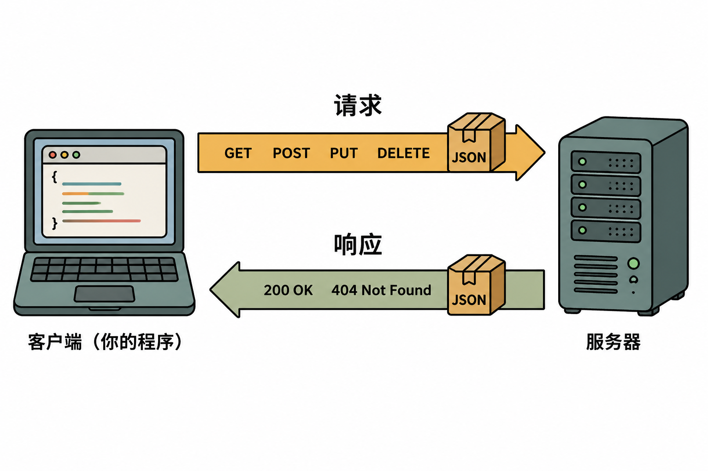
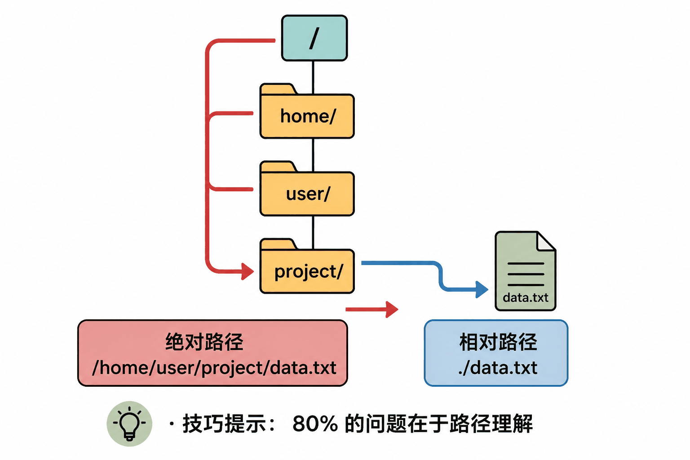

# AI编程（Agentic Coding）时代需要补充的知识基础

> 每个知识点分两层呈现：**专业计算机知识** → **一句话人话版**。先建立准确认知，再记住核心直觉。

---

## 一、API 与网络基础



### 1.1 HTTP 请求方法

**【专业版】**

HTTP（HyperText Transfer Protocol）是应用层协议，定义了客户端与服务器之间的通信语义。核心方法构成 RESTful 架构的基础：

| 方法 | 幂等性 | 安全性 | 语义 |
|------|--------|--------|------|
| GET | 幂等 | 安全 | 读取资源表征 |
| POST | 非幂等 | 非安全 | 创建资源或触发处理 |
| PUT | 幂等 | 非安全 | 完整替换目标资源 |
| PATCH | 非幂等 | 非安全 | 部分修改资源 |
| DELETE | 幂等 | 非安全 | 删除资源 |

幂等性（Idempotency）指同一请求执行一次与执行多次效果相同。GET 的幂等性允许浏览器缓存和重试；POST 的非幂等性意味着重复提交可能创建重复资源（如重复下单）。

状态码采用 RFC 9110 标准的三位数字分类：
- `1xx` 信息响应 → `2xx` 成功 → `3xx` 重定向 → `4xx` 客户端错误 → `5xx` 服务器错误

**【人话版】**

HTTP 方法就是"你要对服务器上的数据做什么动作"。GET 是"看一眼"，POST 是"新建一个"，PUT 是"整个替换"，DELETE 是"删掉"。**POST 点两次可能下两单，GET 点一百次也只是看一百遍，不会多买东西。**

状态码记住这几个就够了：200 是成功，404 是找不到，401 是没权限，500 是服务器崩了，429 是你问太频繁被限流了。

---

### 1.2 JSON 数据格式

**【专业版】**

JSON（JavaScript Object Notation, RFC 8259）是一种轻量级数据交换格式，基于 JavaScript 对象字面量语法子集，但独立于语言。其语法规则：

- 数据结构：对象（`{}` 包裹的键值对集合）与数组（`[]` 包裹的有序值列表）
- 键必须是双引号包裹的字符串；值可以是字符串、数字、布尔值、`null`、对象或数组
- 不支持注释、不支持尾逗号（Trailing comma）、不支持单引号
- 无日期类型，日期通常以 ISO 8601 字符串传递

与 XML、Protobuf、MessagePack 等格式相比，JSON 的优势在于人类可读性和语言无关性；劣势是序列化后的体积较大且解析速度较慢。

**【人话版】**

JSON 就是互联网上的"通用快递盒"。不管对方用 Python、Java 还是什么语言，大家都能读懂这个盒子里的内容。**记住：键必须用双引号，最后一个元素后面不能加逗号，否则程序会炸。**

---

### 1.3 API 调试方法论

**【专业版】**

API 调试遵循分层排查原则：

1. **网络层**：DNS 解析是否正常？TCP 连接是否建立？TLS 握手是否成功？（工具：`curl -v`、`ping`、`openssl s_client`）
2. **协议层**：HTTP 方法、URL、Headers（特别是 `Content-Type`、`Authorization`）是否正确？
3. **应用层**：请求体（Body）的序列化格式是否符合 API 文档？字段名、数据类型、必填项是否匹配？
4. **业务层**：返回的状态码和业务错误码分别代表什么？响应结构是否符合预期 Schema？

调试工具链：`curl`、`httpie`、Postman、Insomnia。

**【人话版】**

API 出问题时，按这个顺序查：**先问"网通了吗"，再问"地址写对了吗"，再问"带身份证（API Key）了吗"，最后问"快递盒里的东西格式对吗"。**

让 Claude 帮你调试时，把**完整的错误信息 + 你的代码文件 + 你调用的 URL** 一起丢给它，比只说"报错了"效率高十倍。

---

## 二、文件系统与路径



### 2.1 路径系统

**【专业版】**

> 【可选深入】以下内容涉及操作系统底层知识，零基础读者可跳过，只读人话版即可。

操作系统通过层级目录树（Hierarchical Directory Tree）组织文件。路径（Path）是定位文件或目录的字符串标识符：

- **绝对路径**：从根目录（Root Directory）开始的完整路径。Unix-like 系统以 `/` 为根；Windows 以盘符（如 `C:\`）为根。
- **相对路径**：以当前工作目录（Current Working Directory, CWD）为基准的偏移路径。`./` 表示当前目录，`../` 表示父目录。
- **特殊符号**：`~` 展开为用户主目录；`.` 表示 CWD；`..` 表示父目录。

路径解析由操作系统内核的 VFS（Virtual File System）层处理。不同 OS 的路径分隔符不同（`/` vs `\`），现代框架通常提供跨平台路径库（如 Python 的 `pathlib.Path`、Node.js 的 `path` 模块）来屏蔽差异。

**【人话版】**

绝对路径是"从地球表面开始的完整地址"，相对路径是"从你现在站的地方怎么走"。**Agent 报错"找不到文件"，80% 是因为它站的地方和你想的不一样。** 不确定时，先让它 `pwd`（打印当前位置）看看。

---

### 2.2 环境变量（Environment Variables）

> [配图占位：此处应有虚拟环境隔离示意图，详见附录D]

**【专业版】**

环境变量是操作系统为每个进程维护的键值对（Key-Value Pair）集合，存储在进程的地址空间中，子进程默认继承父进程的环境变量（除非显式覆盖）。

- **作用域**：Shell 变量（当前 Shell）→ 环境变量（导出到子进程）→ 系统级变量（登录时加载）
- **常见变量**：`PATH`（可执行文件搜索路径）、`HOME`/`USERPROFILE`（用户目录）、`LANG`（区域设置）
- **程序访问**：Python 的 `os.environ`、Node.js 的 `process.env`、Shell 的 `$VAR`
- **安全实践**：敏感信息（API Key、数据库密码）通过环境变量注入，避免硬编码（Hard-coding）导致泄露

**【人话版】**

环境变量就是操作系统给每个程序发的"小抄条"，程序启动时就能读到。`PATH` 告诉系统"去哪里找程序"，API Key 放在这里比写在代码里安全一百倍。**Agent 有时候找不到命令，就是因为 PATH 里没有那个程序的位置。**

---

### 2.3 Agent "找不到文件"的根因

**【专业版】**

文件系统访问失败通常由以下原因导致：

1. **CWD 漂移**：Agent 的当前工作目录与预期不一致。进程启动时的 CWD 由调用者决定，而非脚本所在目录。
2. **路径解析差异**：相对路径基于 CWD 解析，而非脚本文件位置。`./config.json` 在 `/project/` 和 `/project/src/` 下指向不同文件。
3. **大小写敏感**：Linux/macOS 默认文件系统（ext4/APFS）区分大小写；Windows（NTFS）保留大小写但不区分。`Config.json` 与 `config.json` 在 Linux 下是两个文件。
4. **权限模型**：Unix 权限位（rwx/UGO）或 ACL（Access Control List）可能阻止读取/写入/执行。
5. **竞态条件**：文件在检查时刻存在，但在打开时刻被删除或修改（TOCTOU 问题）。

**【人话版】**

Agent 找不到文件，通常是因为：**它站错地方了、大小写写错了、或者没权限打开。** 让 Claude 修的时候，直接说"先 `pwd` 确认位置，再 `ls` 看看文件在不在"。

---

## 三、依赖管理与包管理器

### 3.1 包管理器生态系统

**【专业版】**

包管理器（Package Manager）是自动化处理软件依赖的获取、安装、升级和移除的工具。现代编程语言均拥有成熟的包管理生态：

| 语言 | 工具 | 仓库 | 锁文件 |
|------|------|------|--------|
| Python | pip / uv / poetry | PyPI | `uv.lock` / `poetry.lock` |
| Node.js | npm / pnpm / yarn | npm Registry | `package-lock.json` / `pnpm-lock.yaml` |
| Rust | cargo | crates.io | `Cargo.lock` |
| Go | go mod | proxy.golang.org | `go.sum` |

包管理器解决的核心问题：

- **依赖解析**：处理传递依赖（Transitive Dependencies）和版本冲突（依赖冲突）
- **版本语义化**：遵循 SemVer（`MAJOR.MINOR.PATCH`），`^` 允许兼容更新，`~` 允许补丁更新
- **锁文件**：记录解析后的精确版本树，保证可复现构建（Reproducible Build）

**【人话版】**

包管理器就是"软件应用商店"。你想发邮件？不用自己写，商店里有人写好了，一键安装。**`requirements.txt` 和 `package.json` 就是购物清单，新机器按清单买一遍，环境就搭好了。**

---

### 3.2 虚拟环境（Virtual Environment）

**【专业版】**

虚拟环境通过创建隔离的目录树，为每个项目提供独立的运行时和依赖安装空间，解决以下问题：

- **依赖冲突**：项目 A 依赖 `requests==2.28`，项目 B 依赖 `requests==2.31`，全局安装无法共存
- **系统污染**：全局安装可能覆盖系统工具依赖的包，导致系统不稳定
- **可移植性**：`.venv/` 或 `node_modules/` 不应提交到版本控制，而是通过清单文件重建

Python 实现机制：复制或符号链接 Python 解释器，修改 `sys.path` 优先加载虚拟环境中的 `site-packages`。
Node.js 实现机制：每个项目的 `node_modules/` 目录独立存在，解析算法向上遍历目录树寻找包。

**【人话版】**

虚拟环境就是给每个项目一个**独立的"房间"**，A 项目要 requests 2.28，B 项目要 2.31，互不干扰。**不创建虚拟环境就装包，等于把所有人的东西都堆在一个房间里，迟早打起来。**

---

### 3.3 依赖清单文件

**【专业版】**

**Python (`requirements.txt` / `pyproject.toml`)：**
```text
requests==2.31.0       # 精确版本
pydantic>=2.0.0        # 最低版本，允许更高
pytest~=8.0.0          # 兼容版本：>=8.0.0, <8.1.0
flask>=2.0,<3.0        # 版本范围
```

`pyproject.toml`（PEP 518/621）是现代标准，使用 `[project.dependencies]` 定义依赖，支持 `[project.optional-dependencies]` 定义可选 extras。

**Node.js (`package.json`)：**
```json
{
  "dependencies": { "next": "^15.0.0" },
  "devDependencies": { "typescript": "^5.0.0" }
}
```

- `dependencies`：生产环境必需
- `devDependencies`：开发/构建时必需，生产部署时不安装
- `peerDependencies`：宿主环境应提供的依赖（如插件要求特定版本的宿主框架）

**【人话版】**

`==` 是"必须这个版本"，`>=` 是"至少这个版本"，`^` 是"小更新可以，大更新不行"。**锁文件（如 `package-lock.json`）是"精确快照"，保证每个人装的版本一模一样，避免"我电脑上能跑"的悲剧。**

---

## 四、容器化：Docker

> [配图占位：此处应有 Docker 集装箱比喻图，详见附录D]

### 4.1 容器化技术本质

**【专业版】**

> 【可选深入】以下内容涉及Linux内核技术细节，零基础读者可跳过。

Docker 基于 Linux 内核的以下技术实现操作系统级虚拟化：

- **Namespace**：隔离进程树、网络栈、挂载点、用户 ID 等，使容器内进程看到独立的系统视图
- **Cgroups（Control Groups）**：限制容器的资源使用（CPU、内存、I/O、网络带宽）
- **UnionFS（OverlayFS）**：分层文件系统，镜像层只读，容器层可写，实现高效存储和快速启动

容器 vs 虚拟机（VM）：
- VM：硬件虚拟化，每个 VM 运行完整 Guest OS，启动分钟级，资源占用 GB 级
- 容器：OS 级虚拟化，共享 Host OS 内核，启动秒级，资源占用 MB 级

Docker 的核心抽象：
- **Image**：只读模板，包含应用 + 运行时 + 依赖 + 配置
- **Container**：Image 的运行时实例，可写层叠加在 Image 之上
- **Dockerfile**：声明式构建脚本，定义 Image 的生成步骤

**【人话版】**

Docker 就是**"把整个房间（程序 + 环境 + 配置）打包成一个集装箱"**，搬到哪台机器上打开都一模一样。比虚拟机轻得多，启动只要几秒。**你不需要会写 Dockerfile，只需要知道：遇到"在我电脑上能跑"的问题，让 Claude 帮你 Docker 化。**

---

### 4.2 Docker 使用场景与命令

**【专业版】**

典型工作流：
```bash
docker build -t myapp:1.0 .          # 根据 Dockerfile 构建镜像
docker run -d -p 3000:3000 myapp:1.0 # 后台运行容器，端口映射
docker ps                            # 查看运行中的容器
docker logs <container_id>           # 查看容器日志
docker exec -it <id> /bin/sh        # 进入容器内部调试
docker-compose up -d                 # 编排多容器服务（如 App + DB）
```

`docker-compose.yml` 使用声明式语法定义多容器拓扑，处理服务发现、网络隔离、卷挂载和依赖启动顺序。

**【人话版】**

常用命令就五个：**build（打包）、run（启动）、ps（查看）、stop（停止）、logs（看日志）**。如果项目需要数据库，让 Claude 写个 `docker-compose.yml`，一条命令启动所有服务。

---

## 五、终端与进程管理

### 5.1 进程控制

**【专业版】**

> 【可选深入】以下列出完整的信号机制，零基础读者只需记住人话版即可。

操作系统中，进程（Process）是资源分配的基本单位。Shell 中的进程控制：

- **前台进程（Foreground）**：占用控制终端的标准输入（stdin），按 `Ctrl+C` 发送 `SIGINT` 信号终止，按 `Ctrl+Z` 发送 `SIGTSTP` 信号挂起
- **后台进程（Background）**：在后台执行，不占用终端输入。`&` 符号启动；`bg` 恢复挂起的进程到后台；`fg` 将后台进程调到前台
- **守护进程（Daemon）**：脱离控制终端、在后台长期运行的系统服务（如 `sshd`、`nginx`）

信号（Signal）机制：
- `SIGINT` (2)：中断请求，通常由 Ctrl+C 触发
- `SIGTERM` (15)：优雅终止，允许进程清理资源
- `SIGKILL` (9)：强制终止，内核直接回收资源，进程无法拦截

**【人话版】**

前台进程就是"你在盯着它跑"，后台进程就是"它自己默默跑"。`Ctrl+C` 是"请停下来"，`kill -9` 是"直接拔电源"。**Agent 启动开发服务器后终端被卡住？让它在命令后面加 `&` 放到后台跑。**

---

### 5.2 网络端口（Port）

**【专业版】**

TCP/UDP 协议使用 16 位端口号（0-65535）标识主机上的特定服务进程：

- **Well-known ports**（0-1023）：系统服务，如 22/SSH、80/HTTP、443/HTTPS。需要 root 权限绑定（Unix-like）。
- **Registered ports**（1024-49151）：用户级服务，如 3000（开发服务器常用）、3306/MySQL、5432/PostgreSQL、6379/Redis
- **Dynamic/Private ports**（49152-65535）：临时端口，客户端连接时自动分配

端口冲突（Port Already in Use）发生在多个进程尝试绑定同一 IP:Port 组合时。解决方式：终止占用进程，或让服务监听其他端口。

**【人话版】**

端口就是电脑的"门牌号"。80 号是网页大门，3000 号是开发服务器常用门牌，5432 号是 PostgreSQL 数据库的门。**报错"Port already in use"就是"这个门牌号已经被占了"，要么赶走原来的，要么换个门牌。**

---

### 5.3 环境配置与秘密管理

**【专业版】**

**`.env` 文件模式**：遵循 dotenv 规范，以 `KEY=VALUE` 格式存储环境变量，由程序在启动时加载到 `process.env` / `os.environ` 中。

安全最佳实践：
- `.env` 必须加入 `.gitignore`，防止敏感信息泄露到版本控制
- 提供 `.env.example`（或 `.env.template`）作为配置模板，包含所有必需键但值为空或占位符
- 生产环境使用专门的秘密管理工具：AWS Secrets Manager、HashiCorp Vault、Doppler
- 遵循最小权限原则：不同环境（dev/staging/prod）使用不同的密钥和数据库凭证

**【人话版】**

`.env` 是项目的"密码本"，API Key、数据库密码都写在这里。**这个文件绝对不能提交到 git！** 提交 `.env.example`（去掉真实密码的模板）给其他人参考。让 Claude 帮你做项目时，直接说"帮我创建 .env.example，列出所有需要的环境变量"。

---

## 六、AI编程时代速查卡

### 标准报错提问模板

```text
错误类型：[如 ModuleNotFoundError / ConnectionRefused]
完整错误信息：
[粘贴完整 Traceback 或报错]

上下文：
- 执行命令：[如 npm run dev / python main.py]
- 相关文件：@[文件路径]
- 当前目录：[pwd 输出]
- 已尝试的修复：[如已重装依赖、已检查端口]

请按顺序排查：
1. 根因分析
2. 修复方案
3. 验证命令
```

### 项目启动检查清单

- [ ] 虚拟环境已激活 / `node_modules` 存在
- [ ] 依赖已安装（`pip install -r requirements.txt` / `npm install`）
- [ ] `.env` 已配置（复制 `.env.example` 并填入真实值）
- [ ] 目标端口未被占用（`lsof -i :3000` / `netstat -ano | findstr :3000`）
- [ ] 文件权限正确（Unix: `ls -la` 检查读写权限）

### 高效沟通对照表

| 低效表达 | 高效表达 |
|----------|----------|
| "帮我修一下" | "运行 `npm test` 报错 [粘贴错误]，相关文件 @src/utils.ts，请修复并验证测试通过" |
| "做个网站" | "用 Next.js 15 + Tailwind + shadcn/ui 做个人博客，含首页、文章列表、MDX 渲染、暗色模式" |
| "跑不起来" | "执行 `python main.py` 报 `ModuleNotFoundError: No module named 'requests'`，已确认在虚拟环境中，请排查" |
| "改好看点" | "将主按钮从 `bg-blue-500` 改为 `bg-indigo-600`，hover 时增加 `shadow-lg` 过渡动画，参考 @components/Button.tsx" |

---

> **下一章预告：** 第06章给了你"看懂报错"的知识工具。当你能熟练操作AI工具、能读懂报错信息之后，是什么决定你能走多远？第07章将谈的是AI时代编程者的核心素养——产品思维、安全意识、持续成长的路径。

---

> **核心心法：** AI编程时代，精确的概念认知让你知道"问题大概在哪一层"，清晰的表达让你能把问题准确传达给 AI。**你不需要记住所有命令，但需要知道这些概念存在，以及怎么向 Claude 描述它们。**

